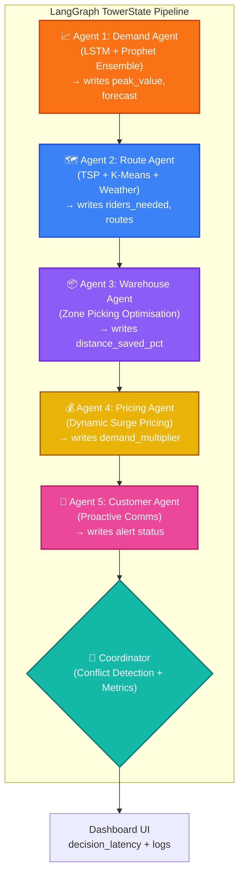

# NinjaVan AI Operations Suite — System Architecture

This document describes the data flow across the 5 AI modules within the NinjaVan Operations Intelligence Suite. The **LangGraph Control Tower** acts as a centralized orchestrator, running a 5-agent sequential pipeline that shares a single `TowerState`. Fraud Detection and the RAG Chatbot are standalone modules that automatically adapt their behaviour based on the demand volume produced by the simulation.

## Control Tower — LangGraph Pipeline

The Control Tower batch pipeline runs 5 sequential LangGraph agent nodes. Each agent reads what the previous agent wrote to `TowerState` and cascades its own decisions downstream.



## Global Demand State — Standalone Module Coordination

After the simulation runs, `global_demand_volume` (the Demand Agent's peak forecast) is returned to the frontend and passed to the two standalone modules:

```
/api/simulate → global_demand_volume
        │
        ├──→ /api/fraud  (global_demand_volume > 15,000 → threshold +0.15)
        │                (global_demand_volume > 8,000  → threshold +0.05)
        │
        └──→ /api/chat   (global_demand_volume > 10,000 → chatbot injects
                          delay-warning context into every response)
```

This means all five AI modules respond to the same demand signal — the Fraud Scanner automatically relaxes its fraud threshold during mega-sales (when legitimate damage rises), and the Chatbot proactively warns customers about SLA extensions before they ask.

## Architecture Justification

1. **5-Agent LangGraph Pipeline:** The Control Tower graph runs five coordinated agent nodes over a shared `TowerState`. Demand feeds Route (how many riders), Route feeds Warehouse (zone assignments), Warehouse feeds Pricing (demand ratio), Pricing feeds Customer (whether to alert). Every decision cascades in sequence.
2. **Global Demand State:** The Demand Agent's peak forecast is written to `global_demand_volume` and propagated to the Fraud and Chatbot modules via the API. This guarantees that fraud strictness and customer messaging are synchronised with live demand — without those modules needing to be LangGraph nodes themselves.
3. **Coordinator Node:** After all 5 agents run, the Coordinator checks for conflicts (e.g., high surge pricing + long delivery times = dual pressure), calculates decision latency, and produces the final recommendation. Full 5-agent coordination completes in under 0.05 seconds.

---

## Customer Chatbot — Detailed Sub-Architecture

The chatbot is itself a separate LangGraph multi-agent system with three pipeline stages:

```
Customer Message
      │
      ▼
┌─────────────────────────────────────────────────────────┐
│  DECOMPOSER NODE (Gemini 2.5 Flash)                     │
│  • Splits multi-question messages into N sub-questions  │
│  • Tags each with intent: tracking / delivery / claims  │
│    / policy / ops / escalation                          │
└───────────────────────┬─────────────────────────────────┘
                        │ [{"question": "...", "intent": "..."}]
                        ▼
┌─────────────────────────────────────────────────────────┐
│  PROCESSOR NODE — per sub-question:                     │
│                                                         │
│  ┌── ChromaDB (5 specialist collections) ──────────┐   │
│  │  nv_tracking / nv_delivery / nv_claims /        │   │
│  │  nv_policy / nv_general                         │   │
│  └──────────────────────────────────────────────────┘  │
│         │ docs found?                                   │
│    YES ─┤─→ Gemini 2.5 Flash (RAG answer)              │
│     NO ─┤─→ DuckDuckGo Web Search → Gemini 2.5 Flash   │
│          │       (Groq Llama-3.3-70B if Gemini 429)     │
└───────────────────────┬─────────────────────────────────┘
                        │ [N answered sub-questions]
                        ▼
┌─────────────────────────────────────────────────────────┐
│  SYNTHESIZER NODE                                       │
│  • Single question: returns answer directly             │
│  • Multi-question: merges with per-agent section headers│
│  • Aggregates: sources, escalated flag, agents_involved │
└─────────────────────────────────────────────────────────┘
                        │
                        ▼
               Final Response + Agent Badge(s)
```

### 6 Specialist Agents

| Agent | Intent | Data Source |
|---|---|---|
| 📦 Tracking Agent | tracking | mock_parcels.csv + nv_tracking ChromaDB |
| 🚚 Delivery Agent | delivery | nv_delivery ChromaDB + live ops_context |
| 📋 Claims Agent | claims | nv_claims ChromaDB |
| 📜 Policy Agent | policy | nv_policy + nv_general ChromaDB |
| 🏭 Ops Agent | ops | live ops_context + nv_delivery ChromaDB |
| 🚨 Escalation Agent | escalation | Direct Gemini (empathy, no RAG) |

### Web Fallback Chain

When ChromaDB returns 0 relevant documents:
1. **DuckDuckGo** searches the web for `"NinjaVan {question}"`
2. Results passed to **Gemini 2.5 Flash** for a grounded answer
3. If Gemini hits rate limit (429 / RESOURCE_EXHAUSTED) → **Groq Llama-3.3-70B** steps in automatically
4. Four badge states: `"RAG + Gemini"` (docs found, Gemini answered), `"RAG + Groq"` (docs found, Gemini rate-limited), `"via Gemini"` (web/direct, Gemini answered), `"via Groq"` (web/direct, Gemini rate-limited)

---

## Technology Stack

| Layer | Technology |
|---|---|
| Frontend | FastAPI + custom HTML (Tailwind CSS + Plotly.js) |
| Backend API | FastAPI (Python) |
| Agent Framework | LangGraph 0.2.x (StateGraph) |
| Primary LLM | Gemini 2.5 Flash (google-genai SDK) |
| Fallback LLM | Groq Llama-3.3-70B (rate-limit only) |
| Web Search | DuckDuckGo (ddgs package) |
| Vector DB | ChromaDB (5 specialist collections) |
| ML Models | Prophet, LSTM (Keras 3.x), Isolation Forest, LightGBM |
| Route Optimization | TSP Nearest-Neighbour + K-Means + Haversine distance matrix |
| Weather Data | Open-Meteo API (live rain forecast, no API key) |
| Cache | joblib.Memory (Gemini response cache) |
| Hosting | Docker on Hugging Face Spaces |

---

## Visual Summary

### System Infographic


### Project Mind Map

